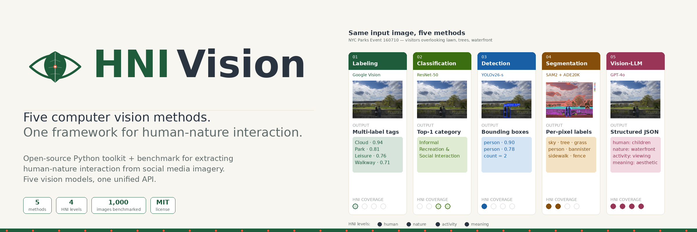
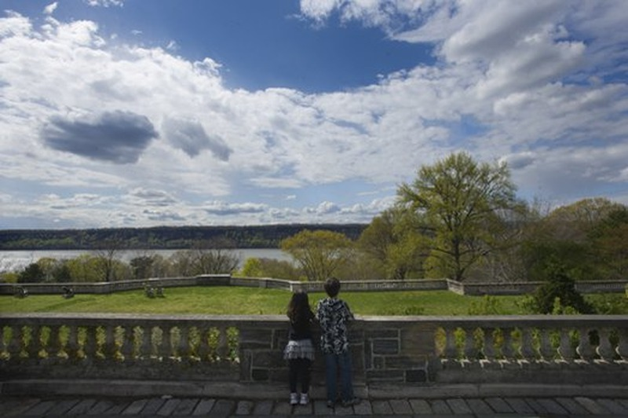
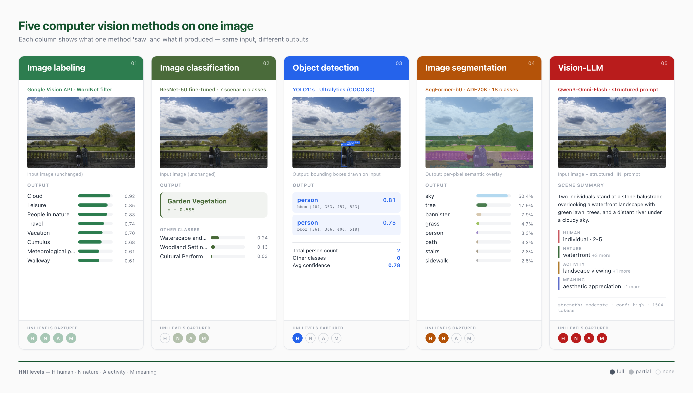

<div align="center">

<a href="https://github.com/LabMingzeChen/HNIVision">

</a>

<br>

[](https://huggingface.co/spaces/Mingze/HNIVision)
[](https://huggingface.co/Mingze/HNIVision-ResNet50)
[](LICENSE)
[](https://www.python.org/)
[](https://pypi.org/project/hnivision/)
[](https://labmingzechen.github.io/HNIVision)
[](#contributing)
[](CITATION.cff)

**A unified Python toolkit and benchmark for extracting human–nature interaction (HNI) evidence from social media imagery.**

[🤗 Live demo](https://huggingface.co/spaces/Mingze/HNIVision) ·
[Documentation](https://labmingzechen.github.io/HNIVision) ·
[Quick start](#-quick-start) ·
[Methods](#-the-five-methods) ·
[HNI framework](#-the-hni-framework) ·
[Benchmark](#-benchmark) ·
[Citation](#-citation)

</div>

---

## Why HNIVision?

Social media imagery has become the dominant lens through which researchers in urban science, ecology, and cultural-ecosystem-services study how people experience nature. But the field has fragmented into five parallel research traditions — each using a different family of computer-vision tools, each capturing a different slice of what an HNI scene actually contains, and each rarely talking to the others.

**HNIVision** unifies these five paradigms under one Python interface, maps every model's output onto a single four-level HNI evidence framework, and ships a reproducible benchmark on 1,000 NYC park event photos. The goal: let any researcher run all five methods on their own dataset in five minutes, then compare which method actually recovers which kind of HNI evidence on their data.

```python
from hnivision import HNIVision

hni = HNIVision(methods="all")
result = hni.extract("park_photo.jpg")

print(result.human)     # → ["2 visitors, side by side", "children"]
print(result.nature)    # → ["waterfront", "lawn", "trees"]
print(result.activity)  # → ["landscape viewing"]
print(result.meaning)   # → ["aesthetic appreciation", "recreation"]
```

---

## What's inside

| Module | Purpose |
|---|---|
| **`hnivision.methods`** | Five vision pipelines behind a common `extract()` interface — image labeling, classification, detection, segmentation, vision-LLM |
| **`hnivision.hni`** | A four-level HNI evidence schema (`human` · `nature` · `activity` · `meaning`) and the mapper that translates each method's raw output into this schema |
| **`hnivision.evaluator`** | Coverage matrix, agreement scores, and confidence calibration across methods |
| **`hnivision.data`** | NYC Parks 2018 benchmark dataset loader + your own dataset adapter |
| **`hnivision.viz`** | Bounding-box, mask, and side-by-side comparison visualizations |
| **`hnivision.cli`** | Command-line entry point — `hnivision extract --image x.jpg` |

---

## 🚀 Quick start

### Install

```bash
pip install hnivision
```

For GPU acceleration (recommended for segmentation and classification):

```bash
pip install "hnivision[gpu]"
```

### Configure API keys

Some methods call external APIs. Copy the example env file and fill in your keys:

```bash
cp .env.example .env
# Edit .env to add:
#   OPENAI_API_KEY=sk-...
#   GOOGLE_APPLICATION_CREDENTIALS=/path/to/service-account.json
```

Methods that work fully offline (`detection`, `classification`, `segmentation`) require no API keys.

### Run all five methods on one image

```python
from hnivision import HNIVision

hni = HNIVision(methods="all")
result = hni.extract("examples/park.jpg")

# Structured 4-level HNI output
result.to_dict()
# {
#   "human":    {"presence": True, "count": 2, "tags": ["children"]},
#   "nature":   {"detected": ["lawn", "trees", "waterfront"]},
#   "activity": {"detected": ["landscape viewing"]},
#   "meaning":  {"detected": ["aesthetic appreciation", "recreation"]},
#   "method_coverage": {...}
# }

# Per-method raw outputs preserved
result.by_method["detection"].boxes
result.by_method["segmentation"].pixel_shares
result.by_method["vlm"].confidence
```

### Or run a single method

```python
from hnivision.methods import Detection

det = Detection(model="yolo26-s")
boxes = det.extract("park.jpg")
print(boxes)
# Boxes(person=2, conf=[0.90, 0.78])
```

### Or use the CLI

```bash
hnivision extract \
  --image park.jpg \
  --methods detection,segmentation,vlm \
  --output result.json \
  --viz overlay.png
```

---

## 📊 The five methods

Each method is a thin wrapper around a well-known model, exposing a single `extract()` call and a `.to_hni()` translator.

<table>
<tr>
<td width="50%" valign="top">

### 1. Image labeling
**Backend:** Google Vision API
**Output:** Multi-label tags with confidence scores
**Best for:** Broad semantic coverage at scale; first-pass screening

```python
from hnivision.methods import Labeling

lab = Labeling()
tags = lab.extract("park.jpg")
# [("Cloud", 0.94), ("Park", 0.81),
#  ("Leisure", 0.76), ("Walkway", 0.71), ...]
```

**HNI coverage:** ◐ human · ◐ nature · ○ activity · ◐ meaning

</td>
<td width="50%" valign="top">

### 2. Image classification
**Backend:** ResNet-50 (fine-tuned on 7 HNI scenario classes)
**Output:** Single top-1 category with softmax confidence
**Best for:** Standardized activity-category tagging; reproducible across studies

```python
from hnivision.methods import Classification

clf = Classification(weights="resnet50-hni-v1.pt")
cat = clf.extract("park.jpg")
# Category("Social and Informal Recreation", p=0.91)
```

**HNI coverage:** ○ human · ◐ nature · ◐ activity · ◐ meaning

</td>
</tr>
<tr>
<td width="50%" valign="top">

### 3. Object detection
**Backend:** YOLOv26-s (Ultralytics, COCO classes)
**Output:** Bounding boxes with class labels and counts
**Best for:** Counting and localizing people, accurate human-presence evidence

```python
from hnivision.methods import Detection

det = Detection(model="yolo26-s")
result = det.extract("park.jpg")
# Boxes(person=2, conf=[0.90, 0.78])
result.annotated_image  # PIL.Image with overlay
```

**HNI coverage:** ● human · ○ nature · ○ activity · ○ meaning

</td>
<td width="50%" valign="top">

### 4. Image segmentation
**Backend:** SAM2 (hiera-small) + SegFormer-b0 (ADE20K)
**Output:** Per-pixel semantic labels across 150 classes
**Best for:** Quantifying the spatial composition of nature vs built environment

```python
from hnivision.methods import Segmentation

seg = Segmentation(backend="sam2+ade20k")
result = seg.extract("park.jpg")
# PixelShares(sky=0.42, tree=0.18, grass=0.09, person=0.02, ...)
result.semantic_mask  # numpy array (H, W) of class IDs
```

**HNI coverage:** ● human · ● nature · ○ activity · ○ meaning

</td>
</tr>
<tr>
<td colspan="2" valign="top">

### 5. Vision-LLM
**Backend:** OpenAI GPT-4o (or any model speaking the OpenAI vision API)
**Output:** Structured JSON aligned to the four HNI levels — the only method that covers all four in a single pass
**Best for:** Cultural and experiential interpretation; multi-level reasoning; relational descriptions ("two children looking at the waterfront")

```python
from hnivision.methods import VLM

vlm = VLM(model="gpt-4o", prompt="default-hni")
result = vlm.extract("park.jpg")
# HNIResult(
#   human="children, 2-5, side by side",
#   nature="lawn, woodland, waterfront",
#   activity="landscape viewing",
#   meaning="aesthetic appreciation, recreation",
#   confidence="high"
# )
```

**HNI coverage:** ● human · ● nature · ● activity · ● meaning

</td>
</tr>
</table>

---

## 🧭 The HNI framework

HNIVision treats every image as evidence at four nested levels. Each method recovers a different subset, and the unified `HNIResult` reconciles them.

| Level | What we ask | Example evidence |
|---|---|---|
| **Human presence** | Are people visible, and how? | individuals · groups · crowd · children · visitors |
| **Nature detection** | What natural environment is shown? | woodland · lawn · flower garden · waterfront · wetland · beach · open field · park path |
| **Activity evidence** | What are people doing? | walking · playing · resting · gathering · watching · learning |
| **Cultural meaning** | What experiential value does the scene suggest? | recreation · aesthetic appreciation · social interaction · education · relaxation · cultural participation |

A scene like *two visitors leaning on a stone balustrade, looking out over a lawn toward the Hudson* registers across all four — but each method "sees" a different slice of it. The benchmark below quantifies how much.

---

## 🖼️ Gallery

A visual deep-dive into how each method actually sees an image. Below, the same photo passes through all five pipelines — see what each captures, what each misses, and how the four-level HNI framework reconciles them.

---

### Example 1 · Visitors at a riverside overlook

**NYC Parks Event 160710 · April 2018 · Fort Tryon Park, Manhattan**

<p align="center">
  
</p>

> *Two visitors lean on a stone balustrade overlooking the Hudson River and the New Jersey Palisades beyond. Mid-spring afternoon, partly cloudy.*

#### Five methods, one image



#### Unified HNI extraction

| Level | What the framework concluded |
|---|---|
| 👤 **Human presence** | 2 children, side by side, standing still |
| 🌳 **Nature detection** | lawn · woodland · **waterfront** (dominant) |
| 🏃 **Activity evidence** | **landscape viewing** (children observing the vista) |
| 💭 **Cultural meaning** | **aesthetic appreciation** · recreation · relaxation |

*HNI present: yes · Strength: moderate · Confidence: high*

#### What each method contributed

This scene illustrates why HNI extraction benefits from method triangulation rather than relying on any single model. **Object detection** nailed the human count (2 visitors) with precise bounding-box localization but contributed nothing to the natural context. **Image segmentation** simultaneously quantified that ~74% of the frame is natural environment (sky 46% + tree 19% + grass 9%) versus ~25% built (path 14% + bannister 11%), aggregated from 60 SAM2 instance masks via per-mask ADE20K majority vote, giving rich spatial composition data — but with no understanding of activity. The **vision-LLM** filled in the critical gap: by reasoning about gaze direction, body posture, and the spatial relationship between humans and waterfront, it inferred *landscape viewing* as the activity and *aesthetic appreciation* as the experiential meaning. **Image labeling** tagged this generically as "Leisure" and "People in nature"; **classification** predicted *Garden Vegetation* as the top scenario (60% confidence) with *Waterscape and Built Settings* second (24%) — interestingly, neither captures the actual relationship between the children and the river view, illustrating the limitations of single-label scenario classification on multi-faceted scenes. Together, the five methods cover all four HNI levels with high confidence — but only the VLM does so in a single pass.

---

*More examples coming as the benchmark is finalized. Have a relevant park/HNI image you'd like analyzed and included? Open an [issue](https://github.com/LabMingzeChen/HNIVision/issues) — we welcome community contributions.*

## 📈 Benchmark

Coverage of each method across the four HNI evidence levels, evaluated on the **NYC Parks Events 2018** benchmark (1,000 images, stratified 84/month).

> **Note** — full results table will be populated when the accompanying paper is finalized. The figures below illustrate the expected output schema; numbers are placeholders.

| Method | Human | Nature | Activity | Meaning | Avg. coverage | Inference time |
|---|---|---|---|---|---|---|
| Image labeling | 0.42 | 0.51 | 0.08 | 0.39 | 0.35 | 0.6 s |
| Image classification | — | — | 0.74 | 0.61 | 0.34 | 0.04 s |
| Object detection | **0.93** | — | — | — | 0.23 | 0.05 s |
| Image segmentation | 0.88 | **0.84** | — | — | 0.43 | 0.8 s |
| Vision-LLM | 0.86 | 0.79 | **0.81** | **0.78** | **0.81** | 3.2 s |

**Reading:** values are agreement with the human-annotated ground truth on each level. Bold = best per column.

See [`docs/benchmark.md`](docs/benchmark.md) for the full evaluation protocol, confusion matrices, t-SNE feature plots, and the reproducible script (`hnivision bench --dataset nyc-parks-2018`).

---

## 📚 Documentation

The full documentation lives at **[labmingzechen.github.io/HNIVision](https://labmingzechen.github.io/HNIVision)** and covers:

- [Getting started](https://labmingzechen.github.io/HNIVision/getting-started/) — installation, configuration, first run
- [Concepts](https://labmingzechen.github.io/HNIVision/concepts/) — what HNI is, the four-level framework, design rationale
- [Methods](https://labmingzechen.github.io/HNIVision/methods/) — one page per method with architecture, parameters, output schema, examples
- [Tutorials](https://labmingzechen.github.io/HNIVision/tutorials/) — running on your own dataset, custom HNI taxonomies, comparing methods
- [API reference](https://labmingzechen.github.io/HNIVision/api/) — auto-generated from docstrings

---

## 🛣️ Roadmap

- [x] **v0.1** — Package skeleton, 5 methods unified behind `BaseHNIMethod`
- [ ] **v0.2** — NYC Parks 2018 benchmark + evaluator
- [ ] **v0.3** — Custom-taxonomy support (bring your own HNI categories)
- [ ] **v0.4** — Hugging Face Spaces demo + Gradio interface
- [ ] **v0.5** — Multilingual VLM prompts (CN / EN / ES)
- [ ] **v1.0** — Companion paper accepted; reproducibility certified

Have a request? Open a [discussion](https://github.com/LabMingzeChen/HNIVision/discussions).

---

## 🤝 Contributing

Contributions are welcome at every level — from typo fixes to new methods to dataset adapters. Please read [CONTRIBUTING.md](CONTRIBUTING.md) for the workflow, code style, and testing requirements.

In particular we'd love help with:

- **New methods.** Add a `BaseHNIMethod` subclass for a model we haven't covered (CLIP, BLIP-2, OWL-ViT, Florence-2, Qwen2.5-VL, …).
- **Dataset adapters.** Wrap a public urban-park / NPS / Flickr photo dataset to plug straight into the evaluator.
- **HNI taxonomies.** Domain experts in CES, environmental psychology, or landscape architecture: help refine the four-level schema.

---

## 📖 Citation

If you use HNIVision in your research, please cite both the software and the accompanying paper:

```bibtex
@software{chen2026hnivision,
  author    = {Chen, Mingze},
  title     = {{HNIVision}: A Unified Framework for Human–Nature Interaction Extraction from Social Media Imagery},
  year      = {2026},
  publisher = {GitHub},
  url       = {https://github.com/LabMingzeChen/HNIVision},
  note      = {Nature AI Lab}
}

@article{chen2026hni,
  author  = {Chen, Mingze},
  title   = {Verifying Computer Vision Methods for Human–Nature Interaction Extraction from Social Media Data},
  journal = {[venue under review]},
  year    = {2026},
  note    = {Companion paper to the HNIVision software}
}
```

GitHub's "Cite this repository" button uses [`CITATION.cff`](CITATION.cff) — please use that to ensure the metadata stays in sync.

---

## 📄 License

HNIVision is released under the [MIT License](LICENSE) — free for academic and commercial use, with attribution. The accompanying NYC Parks 2018 benchmark images remain under their original NYC Open Data terms.

---

## 🙏 Acknowledgments

HNIVision builds on the work of many open-source projects:

- [Ultralytics YOLO](https://github.com/ultralytics/ultralytics) for object detection
- [Meta AI SAM 2](https://github.com/facebookresearch/sam2) for segmentation masks
- [NVIDIA SegFormer](https://huggingface.co/nvidia/segformer-b0-finetuned-ade-512-512) for ADE20K labels
- [Google Cloud Vision](https://cloud.google.com/vision) for multi-label tagging
- [OpenAI](https://openai.com/) for the multimodal reasoning backbone
- [NYC Parks Open Data](https://www.nycgovparks.org/) for the benchmark imagery

Built at **[Nature AI Lab](https://github.com/LabMingzeChen)** by Mingze Chen.

<div align="center">
<sub>If you find HNIVision useful, please ⭐ star the repository — it helps other researchers find this work.</sub>
</div>
